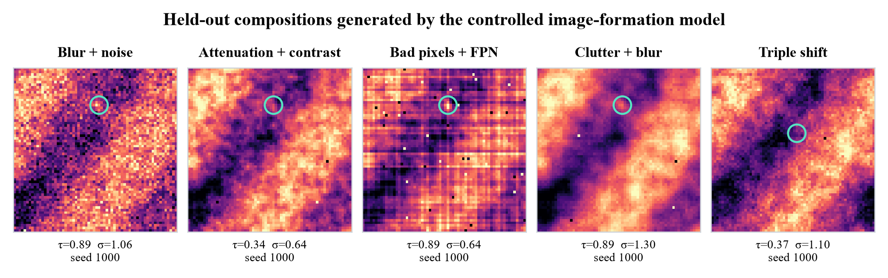
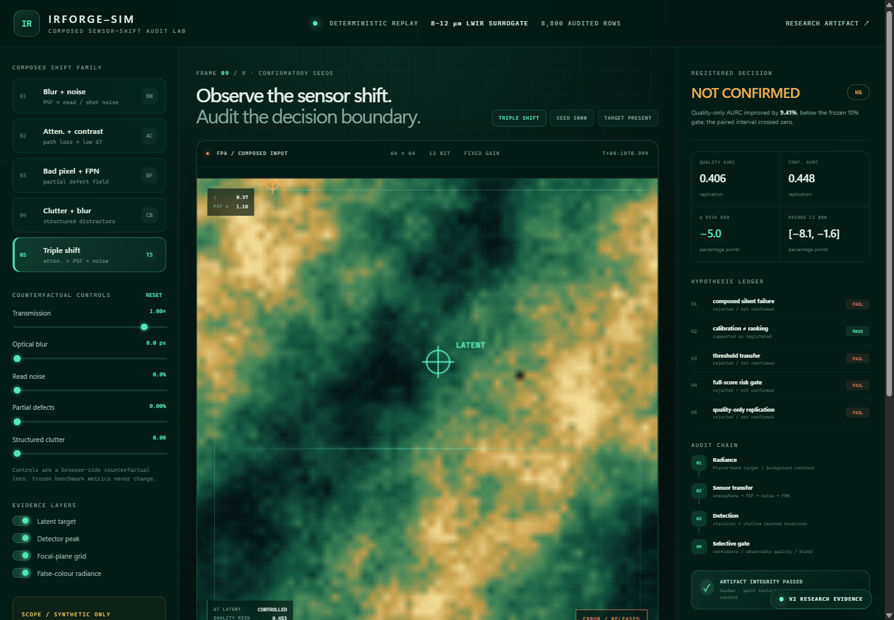
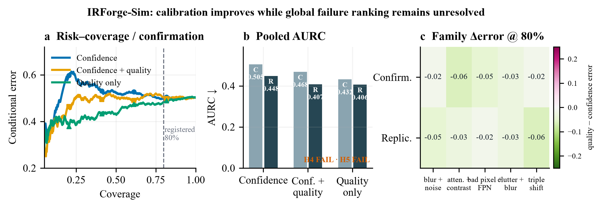

# IRForge-Sim

A simulated infrared sensor bench for measuring detection errors and rejection decisions as image quality changes.



IRForge-Sim follows target and background radiance through atmospheric attenuation, blur, noise and sensor defects. It runs fixed detectors on the resulting images and measures how often their accepted predictions are wrong. Individual degradations can be combined or varied through time.

The repository includes two classical detectors, a shallow learned baseline, confidence calibration, rejection rules and 43,360 stored evaluation rows. The browser shows the same recorded samples and results as the Python experiments.

## Temporal comparison at the sequence level

The [paired sequence analysis](artifacts/sequence-pair-analysis/REPORT.md) resamples complete 12-frame sequences within each drift family. This preserves temporal dependence and pairing between selectors. It reports coverage and correct accepted frames alongside false release, so rejecting everything cannot look useful.

On 240 held-out sequences, temporal CRC minus confidence CRC has a sequence false-release difference of **+2.50 percentage points**, with a pointwise 95% bootstrap interval of **[-2.92, +7.92]**. The result does not establish an improvement. The six family-level results help locate where the difference changes sign.

```bash
python scripts/analyze_sequence_pairs.py
```

## Research context

[RealScene-ISTD](https://arxiv.org/abs/2504.16487), [S2CPNet](https://arxiv.org/abs/2604.01934) and [DAISOD](https://arxiv.org/abs/2608.09311) address real-scene generalization, cross-domain representations and degraded-image detection. IRForge provides controlled perturbations for studying failure mechanisms; it has not been compared with these systems on their datasets.

The open question here is whether observable sensor quality helps a fixed detector decide when to abstain after conditions change. Sequence CRC failed several held-out-drift criteria. [Prinster et al.](https://proceedings.mlr.press/v235/prinster24a.html) show that validity beyond exchangeability requires an appropriate treatment of the joint distribution; their result does not make ordinary calibration automatically valid under arbitrary drift.



## Temporal drift experiment

H6 moves beyond independent still frames. It generates replayable 12-frame
sequences with target motion, gain/offset drift, fixed-pattern creep, blur,
defective-pixel growth and unseen compositions. A causal running-background
residual provides a standard temporal baseline. The release controller calibrates
bounded sequence loss: a window is a loss if **any accepted frame is wrong**,
so dependent frames are never treated as independent calibration examples.

The 34,560-row frozen result identifies two sharp failure boundaries. On matched
drift, temporal conformal risk control reached only `2.5%` sequence false-release
risk (Wilson upper `6.09%`) but accepted just `4.79%` of frames, failing the
registered 15% utility floor. On unseen drift its observed risk was higher than
confidence CRC (`15.42%` vs `12.92%` sequence risk), but the paired sequence
interval includes zero. The registered improvement criterion was not met.
The causal temporal-residual detector did pass its
registered baseline gate in two of three unseen families.

| H6 contract | Outcome |
|---|---:|
| Matched sequence risk | 2.50%, but coverage only 4.79% |
| Held-out temporal vs confidence CRC | 15.42% vs 12.92%; H6-B fails |
| Matched-coverage error delta | -9.59 pp, interval crosses zero |
| Temporal detector family wins | 2 / 3 within false-alarm budget |
| Independent artifact checks | 12 / 12 pass |
| Python tests at H6 freeze | 21 / 21 pass |

See [H6 analysis](experiments/H6-temporal-conformal-risk/analysis.md),
[summary](artifacts/confirmatory-h6/summary_h6.json), and
[validation report](artifacts/confirmatory-h6/validation-report-h6.json). The
web lab's Temporal study panel displays the committed result.

## Still-image results

The joint success criteria were not met in either the confirmation or the untouched-seed replication.

| Study | Seeds per composed family | Confidence AURC | Full blend AURC | Quality-only AURC | Registered decision |
|---|---:|---:|---:|---:|---|
| Confirmation | 1000–1079 | 0.5047 | 0.4680 | 0.4316 | H1/H3/H4 fail; H2 passes |
| Frozen H5 replication | 2000–2079 | 0.4482 | — | 0.4060 | H5 fails |

Temperature scaling reduced ECE from `0.1405` to `0.0772` while leaving AURC exactly `0.5047`: calibration improved, error ordering did not. In the replication, quality-only AURC improved by `9.41%`, below the frozen `10%` gate, and its paired interval crossed zero. A secondary fixed-80%-coverage diagnostic did show a `5.0` percentage-point error reduction with a wholly negative interval; this is reported as a narrower operating-region observation, not a global claim.



## What is implemented

```text
Planck-band radiance
        ↓
atmospheric transmission × target/background contrast
        ↓
Gaussian PSF × shot/read noise × FPN × partial bad pixels × quantization
        ↓
local contrast | matched filter | shallow learned pixel detector
        ↓
temperature calibration
        ↓
confidence | observable image quality | confidence–quality interaction
        ↓
risk–coverage curve + fixed-coverage paired bootstrap + exact replay audit
```

The five held-out composition families are `blur_noise`, `attenuation_contrast`, `badpixel_fpn`, `clutter_blur` and `triple_shift`. Training and calibration use only nominal or single-axis families.

## Sensor bench

The web instrument requires Node.js 22.13 or newer (CI uses Node 24) and pnpm 11.19.0.

The web lab replays exact frozen frames and exposes:

- latent-target and detector-peak overlays;
- browser-side counterfactual transmission, PSF, noise, defect and clutter controls;
- confirmation/replication risk–coverage switching;
- family-level error deltas at exactly 80% coverage;
- the complete H1–H5 pass/fail ledger and integrity boundary.

```powershell
cd web
pnpm install
pnpm run dev
```

The counterfactual sliders are explicitly separated from frozen benchmark metrics. Moving a slider never rewrites a scientific result.

## Reproduce

Python 3.10+ is required.

```powershell
python -m pip install -e .
python -m unittest discover -s tests -v

# Validate 34,560 rows, CRC contracts, hashes and deterministic sequence replay
python scripts/validate_h6_artifact.py artifacts/confirmatory-h6

# One deterministic sample
irforge simulate --family triple_shift --seed 1003 --out sample.npz

# Rebuild publication figures and browser data from committed CSVs
python figures/gen_fig_failure_atlas.py
python figures/gen_fig_sensor_shift_gallery.py
python scripts/export_dashboard.py

# Validate the immutable studies
python scripts/validate_artifact.py --artifact artifacts/confirmatory
python scripts/validate_artifact.py --artifact artifacts/replication-h5
```

The full benchmark command is intentionally expensive relative to a smoke test:

```powershell
python scripts/run_benchmark.py --out artifacts/confirmatory
python scripts/run_quality_replication.py
```

Do not overwrite the committed artifacts unless intentionally creating a new study with a new protocol and seed range.

## Repository map

| Path | Role |
|---|---|
| `src/irforge_sim/image_formation.py` | controlled radiance-to-digital-count simulator |
| `src/irforge_sim/detectors.py` | classical and shallow learned baselines |
| `src/irforge_sim/selective.py` | temperature calibration and quality-aware risk gates |
| `src/irforge_sim/metrics.py` | detection, ECE, AURC and paired bootstrap metrics |
| `experiments/` | protocols committed before results, plus analyses |
| `artifacts/confirmatory/` | first frozen 4,400-row matrix and validation report |
| `artifacts/replication-h5/` | untouched-seed 4,400-row replication and decision manifest |
| `figures/` | reproducible vector/raster publication figures |
| `web/` | interactive audit lab sourced from the same CSVs |
| `research-log.md` / `findings.md` | chronological decisions and bounded conclusions |

## Research integrity

Original local protocol and result commits are preserved in the [development history archive](docs/HISTORY.md); the first public branch is a source snapshot.

- Training/calibration seeds are `<1000`; confirmation uses `1000–1079`; H5 replication uses `2000–2079`.
- Protocol commits precede both result commits.
- Every published matrix stores CSV/summary hashes and the executed source hash.
- Validation checks row count, seed ranges, family coverage, split isolation, bitwise image replay, selected-row numerical replay within `1e-6`, deterministic sequence replay and a zero-contrast negative control.
- Failed hypotheses remain visible in the README and dashboard.

See [architecture](docs/architecture.md), [technical report](docs/technical-report.md), [reproduction guide](docs/reproduction.md), [benchmark card](docs/benchmark-card.md), and the [focused literature survey](literature/survey.md).

## Scope and limitations

IRForge-Sim uses controlled synthetic LWIR-like imagery: independent frames for H1–H5 and deterministic 12-frame drift sequences for H6. It is not fitted to a named sensor, does not implement multi-object tracking, and does not establish real-world detection performance or operational safety. The shallow learned detector is intentionally interpretable and computationally light; it is not claimed as state of the art.

## Citation

Citation metadata is provided in [`CITATION.cff`](CITATION.cff). Code is released under the MIT License.
